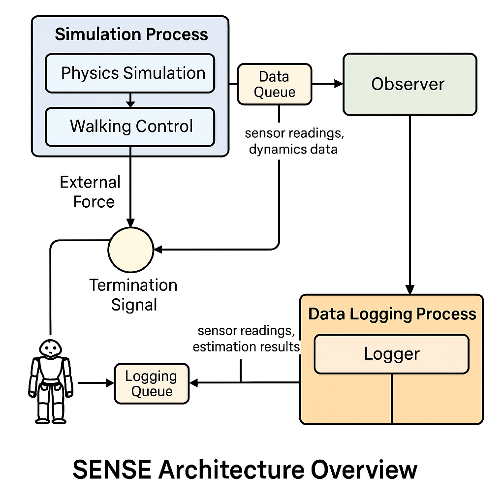

# SENSE: A Force-Sensor-Free, Model-Based Framework for Estimating External Interaction Forces on Humanoid Robots

SENSE is a real-time, model-based solution for estimating external forces on humanoid robots without the need for force/torque (F/T) sensors. It leverages centroidal dynamics and angular momentum to provide accurate, low-cost estimation suitable for physical human-robot interaction (pHRI), particularly on platforms like NAO.

<p align="center">
  
</p>

---

## 🧠 Key Features

- Model-based observer using centroidal dynamics and angular momentum
- Real-time execution (<5ms per estimation step)
- No external sensors required: only onboard IMU, FSR, and encoders
- Comparative evaluation against LIP-based observers (Hawley, Stephens)
- Supports static standing and dynamic walking scenarios
- Fully open-source and reproducible

---

## 🛠 Installation

```bash
git clone https://github.com/chofdc/sense-humanoids.git
cd sense-humanoids
pip install -r requirements.txt
```

Make sure `pybullet` and `qibullet` are installed and accessible in your Python environment.

---

## ▶️ How to Run

### For Static Standing Estimation:
```bash
python src/online_main_force_observers.py
```

### For Dynamic Walking + Force Estimation:
```bash
python src/online_walking_main_force_observers.py
```

The walking scenario replays pre-recorded joint trajectories stored in the `motions/` folder.

---

## 📁 Project Structure

- `src/` – Main codebase (observers, config, metrics, visualizer)
- `motions/` – CSV files with walking trajectories
- `figures/` – Figures from the paper
- `requirements.txt` – Python dependencies
- `.gitignore`, `LICENSE`, `README.md` – Standard project files

---
<!--

## 📊 Reproducing the Results

The observers were evaluated under:

- Constant force: [0, 0, Fz]
- Sinusoidal force: Fx(t), Fy(t)
- Walking + hybrid force: sinusoidal (x, y) + constant (z)

All key metrics (RMSE, MAE, TTC) and plots can be reproduced using:
```bash
python src/metrics_qibullet.py
python src/visualize_datapro.py
```

---
-->

## 📄 Citation

If you use this work in your research, please cite:

```
@inproceedings{fedsi2025sense,
  title={SENSE: A Force-Sensor-Free, Model-Based Framework for Estimating External Interaction Forces on Humanoid Robots},
  author={Fedsi, Chouaib and Mallem, Malik and Guiatni, Mohamed},
  booktitle={2025 34th IEEE International Conference on Robot and Human Interactive Communication (ROMAN)},
  pages={xx--xx},
  year={2025},
  organization={IEEE}
}
```

---


## 🤝 License

This project is licensed under the MIT License.
